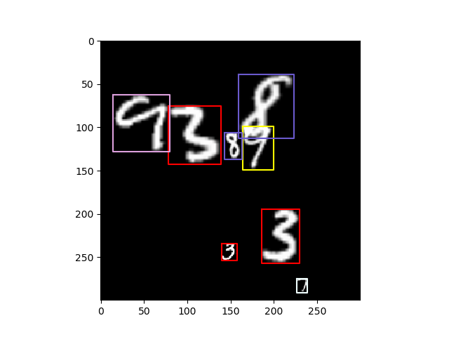

# MNIST Object Detection dataset


### Installation
Requires python>= 3.6
```bash
pip install -r requirements.txt
```

### Generate dataset 
```bash
python3 generate_dataset.py
```

You can also change a bunch of settings by writing:
```bash
python3 generate_dataset.py -h
```

### Visualize dataset
```bash
python3 visualize_dataset.py data/mnist_detection/train/
.py
```